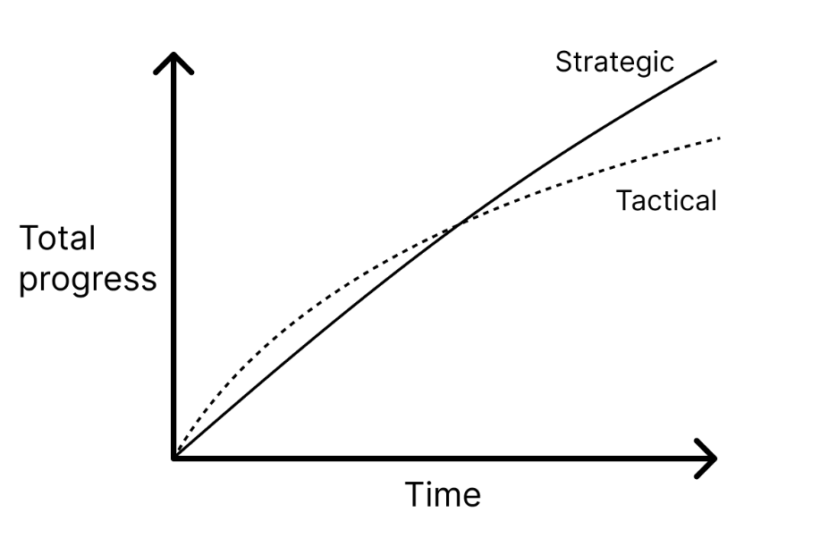

# Good Engineering Practices for Data

This repository is an adaptation of one I created in a professional setting to create more resources and training for data practitioners (engineers, analysts, scientists, etc.) around good engineering practices. Many of these data practitioners do not come from traditional software engineering backgrounds where these types of practices are taught and these practices have yet to make their way into formal data education and training. Hence the need for this repository.

The materials in this repository were originally planned as part of a biweekly series of 30 minute trainings and conversations, but these materials can be adapted for other formats. The examples primarily focus on data product development in R and Python, but the same general principles apply to SQL and data engineering more broadly. The expectations for this series were not that people master the content but rather they gain exposure to these practices, know when to implement them, and know where to go for more information about how to implement them.

Note that throughout this repository I use the phrase **good practices** rather than **best practices** because I believe what is a "best" practice in the world of data is still largely being determined.

## Background

### Why are we running this series?

Because “working code is not enough”. In order to create better products, we need to shift away from tactical programming and towards strategic programming:

- In **tactical programming**, the main focus is on getting a new feature or bug fix working regardless of how much complexity it introduces into the code design.
- In **strategic programming**, the primary goal is to produce a great design with minimal complexity, which also happens to work.

At the beginning, tactical programming will make progress more quickly but accumulates complexity (i.e. technical debt) more rapidly. Over time, strategic programming results in greater progress.

### What is complexity?

Complexity is anything related to the structure of a software system that makes it hard to understand and modify the system.

The symptoms of complexity are:

- **Change Amplification**: Seemingly simple changes require code modifications in many different places
- **High Cognitive Load**: Developers have to spend more time learning the required information in order to complete a task
- **Unknown Unknowns**: It is not obvious which pieces of code must be modified to complete a task successfully

The causes of complexity are:
- **Dependencies**: A given piece of code cannot be understood and modified in isolation
- **Obscurity**: Important information is not obvious

Complexity is not caused by a single dependency or obscurity by itself but by the compounding of many small dependencies and obscurities building up over time. ***Complexity is incremental.***

### What is the goal of this series?

The goal of this series is to learn about good engineering practices and start practicing them in our programming to reduce our code complexity and increase our code base context sharing.

### What are the prerequisities for this series?

- At least R v4.0.0+
    - Tidyverse package
- At least Python 3.0.0+ but preferably a more recent version
- RStudio Desktop 2022.07.1+554
- At least Visual Studio Code v1.71 with the following extensions:
    - Python extension
    - R extension
- Git set up on your computer and ability to clone this repository

## Repo Navigation

There is a folder in this repository for each training topic. Follow the instructions in the README of each folder to complete the labs and exercises.

## Resources

- A Philosophy of Software Design by [John Ousterhout](https://web.stanford.edu/~ouster/cgi-bin/home.php) 
    - This is an extremely accessible and easy to read reference on good software design principles compiled by Stanford University professor through his experience teaching CS190: Software Design Studio 
    - [Paperback book](https://www.amazon.com/dp/1732102201)
    - [Kindle edition](https://www.amazon.com/Philosophy-Software-Design-2nd-ebook/dp/B09B8LFKQL/ref=tmm_kin_swatch_0?_encoding=UTF8&qid=&sr=)
    - [Book review](https://blog.pragmaticengineer.com/a-philosophy-of-software-design-review/)
- [Data Products Aren’t Exempt From Good Engineering Practices](https://ericdataproduct.substack.com/p/data-products-arent-exempt-from-good?utm_source=%2Fprofile%2F2258741-eric-weber&utm_medium=reader2) by Eric Weber
    - Eric Weber is the Senior Director of Experimentation and Causal Inference at StitchFix.
    - He writes about Data Products in his substack [From Data to Product](https://ericdataproduct.substack.com/?utm_source=substack&utm_medium=web&utm_campaign=substack_profile&utm_source=%2Fprofile%2F2258741-eric-weber&utm_medium=reader2) and shares similar thoughts on his [LinkedIn](https://www.linkedin.com/in/eric-weber-060397b7/).
- [7 Tips to Produce Readable Data Science Code](https://www.kdnuggets.com/2022/11/7-tips-produce-readable-data-science-code.html) on KDnuggets
- [Building Blocks of Production-Ready Code: Reproducability](https://dutchengineer.substack.com/p/building-blocks-of-production-ready) by Sarah Floris
    - Sarah Floris is a senior data and machine learning engineer.
    - She writes about Data Engineering in her substack [Dutch Engineer](https://dutchengineer.substack.com/?utm_source=account-card&utm_content=writes) and shares similar thoughts on her [LinkedIn](https://www.linkedin.com/in/sarah-floris/)