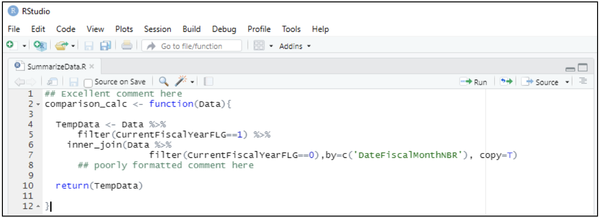
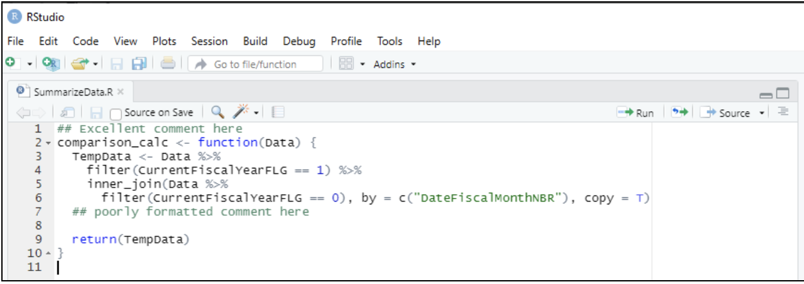
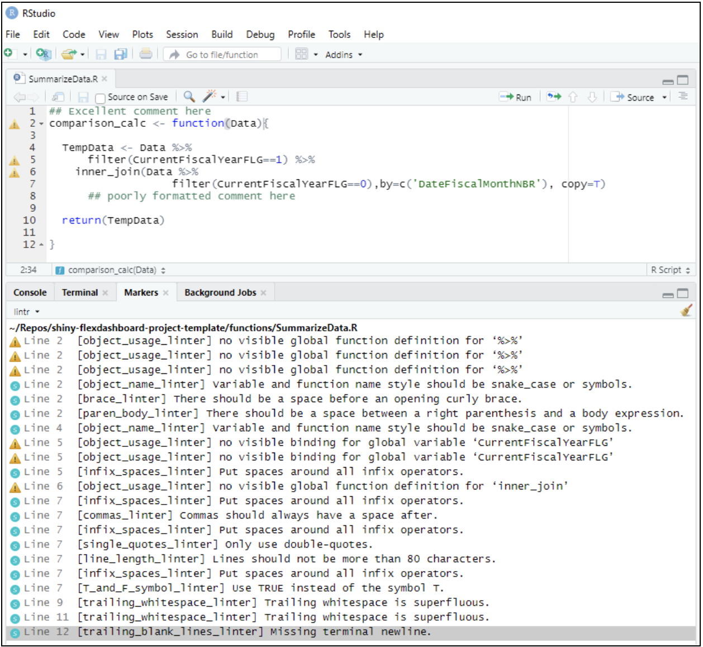
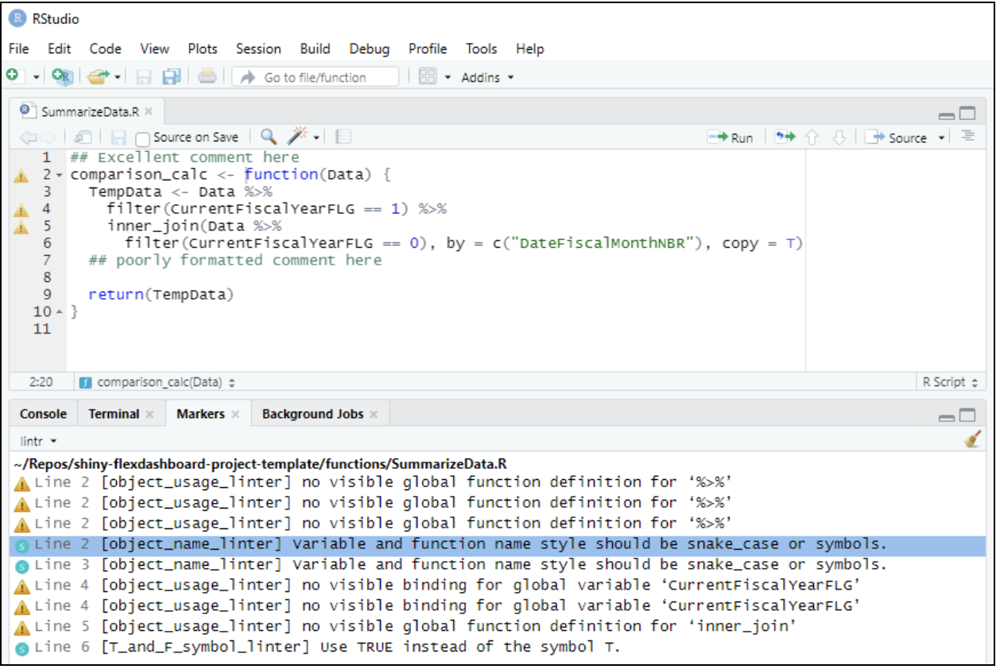
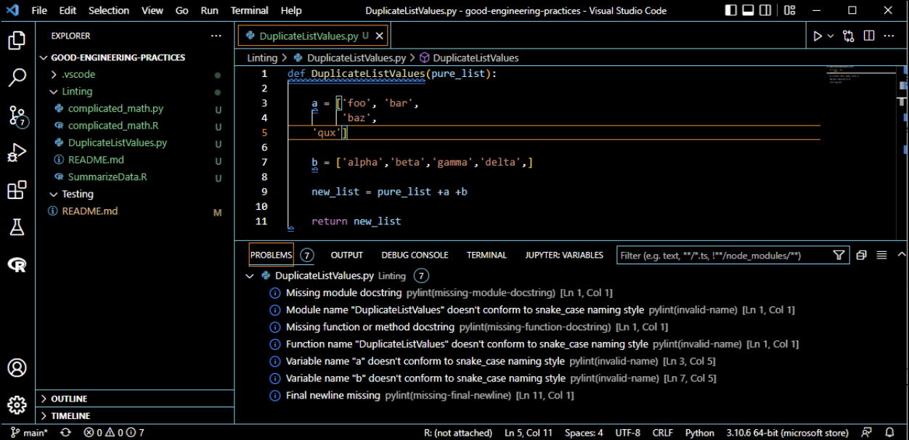
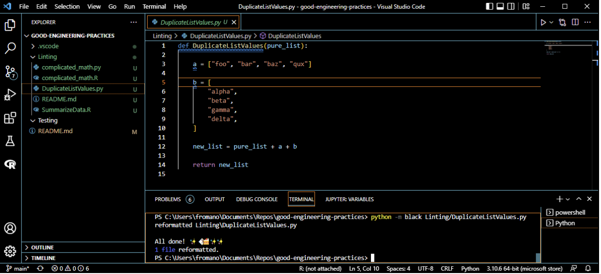
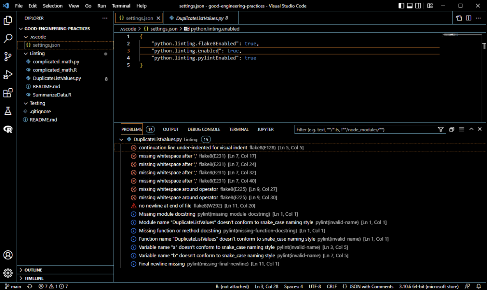

# Style Guides and Linting

Please note that the example scripts in this folder are intentionally BAD example of how to style your code. Please do NOT use them as templates for good coding practices.

## Style Guides

A programming style guide is a written document containing guidelines and rules to use when writing code.

*Why use a style guide?* Conforming code to a style guide makes the code easier to maintain and easier to code review.

*Am I expected to read and memorize these style guides?* **NO.** Read the introductions. Skim the rest of the documentation so you are familiar enough with the structure to know where to look for information when you need it. These are also great references to have on hand if you are conducting a code review.

### R

The style guide we will use for programming R is the [tidyverse style guide](https://style.tidyverse.org/) put together by Hadley Wickham. In addition to these guidelines, we will also strive to limit the use of base R in our code to only the functionality that tidyverse R cannot provide.

To automatically style our code, we can install and use the [styler package](https://styler.r-lib.org/), which is an add in for the RStudio IDE.

### Python
The standard style guide used for Python is [PEP-8](https://peps.python.org/pep-0008/) (Python Enhancements Proposals). To automatically style our code, we can install and use the [black package](https://pypi.org/project/black/), which is a Python code formatter.

## Linting

Linting is the automated checking of your source code for programmatic and stylistic errors using a static code analyzer.

***Please be aware that both static code analyzers and automatic styling packages are NOT perfect and they will sometimes have false negative or false positive results. Not every error they detect may make sense to resolve so use the context of your code base to help you decide! However, they can still be powerful and should be treated as a tool in the toolbox for improving code style and not a magic bullet.***

Wait until right before you are ready for a merge request to style and lint. You do not need to style or lint your code every time you make an edit!

### R Tutorial

To lint in R, install the [lintr package](https://github.com/r-lib/lintr) and follow [these instructions](https://lintr.r-lib.org/articles/editors.html) to set up linting in your editor of choice. The lintr package is intended to be used as a complement to the styler package with the easiest workflow being to use styler first and then use lintr.

Open the `SummarizeData.R` script in the RStudio IDE and practice using the styler and lintr packages according to the steps below:

1. Observe the following poorly formatted R script containing one function in `SummarizeData.R`:
    - Many of the indentations do not make sense.
    - Line 7 has a comma followed by no space and a comma followed by a space.
    - Line 7 also exceeds 80 characters.
    - The file contains only one function but the file name does not match the function name and the function doesn’t use snake_case as recommended by the style guide.

    
    

2. To style this script using stylr, **Addins > Style active file** produces the following:

3. To lint, make sure the script is saved and go to **Addins > Lint current file** or enter **lintr::lint("SummarizeData.R")** into the Console. This will flag row numbers in your script that may need attention and it will generate a **Markers** pane that lists all of the programmatic and stylistic errors that it found. Running lintr on the original code from above produces the following 21 errors:

4. Running lintr on the code that has already had styler applied produces only 9 errors. Note that styler identified and resolved 12 of the 15 stylistic errors that line identified. However, there are still 3 stylistic errors that lintr identified and probably make sense to address manually, like switching the variable names to be snake case. Also note that the 6 stylistic errors that lintr identified probably do not make sense to address since this function will presumably be loaded into a main script that already has the dependent libraries loaded.

Try the same on the `complicated_math.R` function and feel free to make your own edits to these R scripts to see how styler and lintr handle the changes.

### Python Tutorial

Most commonly used IDEs for python have built in linting functionality that is based on the [pylint](https://pylint.pycqa.org/en/latest/) package, which is a static code analyzer that checks for errors, enforces a coding standard recommended by PEP 8, looks for code smells, and can make suggestions for how the code should be refactored. To enable linting in your IDE of choice, follow these steps:
- [PyCharm - ESLint](https://www.jetbrains.com/help/pycharm/eslint.html)
- [Spyder - Code Analysis](https://docs.spyder-ide.org/current/panes/pylint.html)
- [VSCode - Python Linting](https://code.visualstudio.com/docs/python/linting)

Open the `DuplicateListValues.py` script in the VSCode IDE and practice using the black and pylint packages according to the steps below:

1. For this tutorial, we will be using VSCode with the pylint Linter enabled. Observe the following poorly formatted Python script containing one function in `DuplicateListValues.py`:
    - Some of the indentations do not make sense.
    - The spacing between list items is inconsistent to non-existent.
    - There is not consistent spacing before and after assignment or mutating operators (= and +).
    - The file contains only one function but the file name does not match the function name and the function name doesn’t use snake case as recommended by the style guide.

    Once the pylint Linter is enabled, the “Problems” window of the IDE automatically lists out many of these issues as well as several others. Additionally, the issues are highlighted directly in the script itself with red and blue underlines. Hovering over each of these generates a pop up box with more information.

    

2. To style this script using black, exit the script and enter the command shown in the terminal below. When you reopen the script, the script will appear newly formatted as shown in the screenshot. Note that running black did eliminate many of the formatting issues in this script, including some that pylint did not detect, but there are still problems being flagged by pylint that should be addressed like the lack of a use of snake case and the lack of doc strings for this module.

3. As an added bonus, go into the .vscode/settings.json file created in the repository when you enabled the pylint Linter and edit it to enable flake8 limiting as well. Notice how the number of problems with the original DuplicateListValues.py script increases to 15 with both linters enabled.

 Try the same on the `complicated_math.py` function and feel free to make your own edits to these Python scripts to see how styler and lintr handle the changes.

## Resources

- [What is a Programming Style Guide and Why Should You Care?](https://medium.com/level-up-web/what-is-a-programming-style-guide-and-why-should-you-care-9019e51bb7ad) By Bradley Nice on Medium
