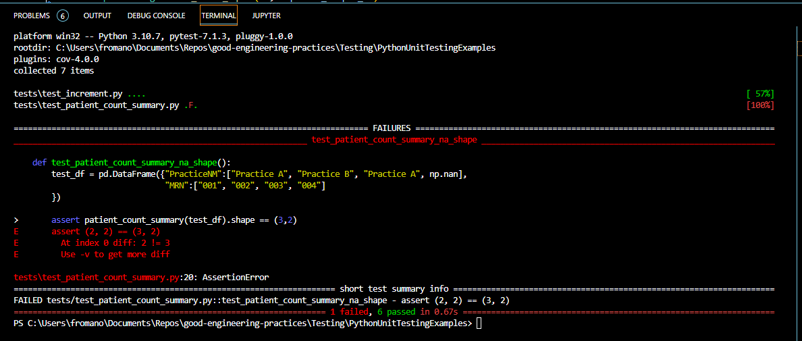

# Python Unit Testing Examples

Open up the VSCode IDE and set the working directory to this folder. Open up the `increment.py` and `patient_count_summary.py` scripts to see what each of the `increment` and `patient_count_summary` functions do.

Then open up the `tests/test_increment.py` and the `tests/test_patient_count_summary.py` scripts to see what unit tests have been written for each of the functions. Note that these unit tests are using a blend of `assert` statements, testing functions built into the NumPy package, and testing functions built into the pandas package. Additionally, note that the unit tests for the `patient_count_summary.py` function are testing for both desired values output by the function and attributes of the output dataframe, like the dimensions. These examples are only the tip of the iceberg in terms of the functionality that the [pytest](https://docs.pytest.org/en/7.1.x/), [NumPy](https://numpy.org/doc/stable/reference/routines.testing.html), and [pandas](https://pandas.pydata.org/pandas-docs/version/0.22.0/api.html#testing-functions) packages provide. There are much more advanced unit tests that can be written with these packages and should be considered as options for us to use as well!

To run the unit tests, call `python -m pytest tests/` from the Terminal in the VSCode IDE. You should get all passing tests for the `increment` function and two failed tests for the `patient_count_summary` function as shown in the image below.

These results can be interpreted as follows:

- If you pass a dataframe with PracticeNM values of `NaN`, those rows will NOT be counted as legitimate practices in the final summary table, which is not the desirable outcome since we would like a count of patients not empaneled to any practice included in the final result.

In order for these unit tests to pass, code changes should be made to the `patient_count_summary` functions so that the desired output is produced in each of the scenarios of the failed unit tests.

Compare and contrast these tests and results to the similar functions and tests in the `RUnitTestingExamples` folder. In particular, note how all of the testws on the `increment` function succeed in python but one of them fails in R because of how differently R treats `NA` values than how python treats `NaN` values. Similarly, the R test that fails for the `patient_count_summary` function is different than the Python test that fails because of how differently R treats `NA` values than how `python` treats `NaN` values. This is a great example of how unit testing can be critically important for testing edge cases.