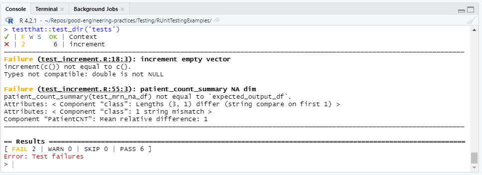

# R Unit Testing Examples

Open up the RStudio IDE and set the working directory to this folder. Open up the `increment.R` and `patient_count_summary.R` scripts to see what each of the `increment` and `patient_count_summary` functions do.

Then open up the `tests/test_increment.R` and the `tests/test_patient_count_summary.R` scripts to see what unit tests have been written for each of the functions. Note that the unit tests for the `patient_count_summary.R` function are testing for both desired values output by the function and attributes of the output dataframe, like the dimensions.

To run the unit tests, call `testthat::test_dir('tests')` from the Console in the RStudio IDE. You should get one failed test for each of the functions as shown in the image below.

These results can be interpreted as follows:

- If you pass an empty vector to the `increment` function, it does not return another empty vector as expected.
- If you pass a dataframe with MRN values of `NA`, those rows will be counted as legitimate patients in the final patient count, which is not the desirable outcome.

In order for these unit tests to pass, code changes should be made to each of the `increment` and `patient_count_summary` functions so that the desired output is produced in each of the scenarios of the failed unit tests.

Compare and contrast these tests and results to the similar functions and tests in the `PythonUnitTestingExamples` folder. In particular, note how all of the testws on the `increment` function succeed in python but one of them fails in R because of how differently R treats `NA` values than how python treats `NaN` values. Similarly, the R test that fails for the `patient_count_summary` function is different than the Python test that fails because of how differently R treats `NA` values than how `python` treats `NaN` values. This is a great example of how unit testing can be critically important for testing edge cases.
